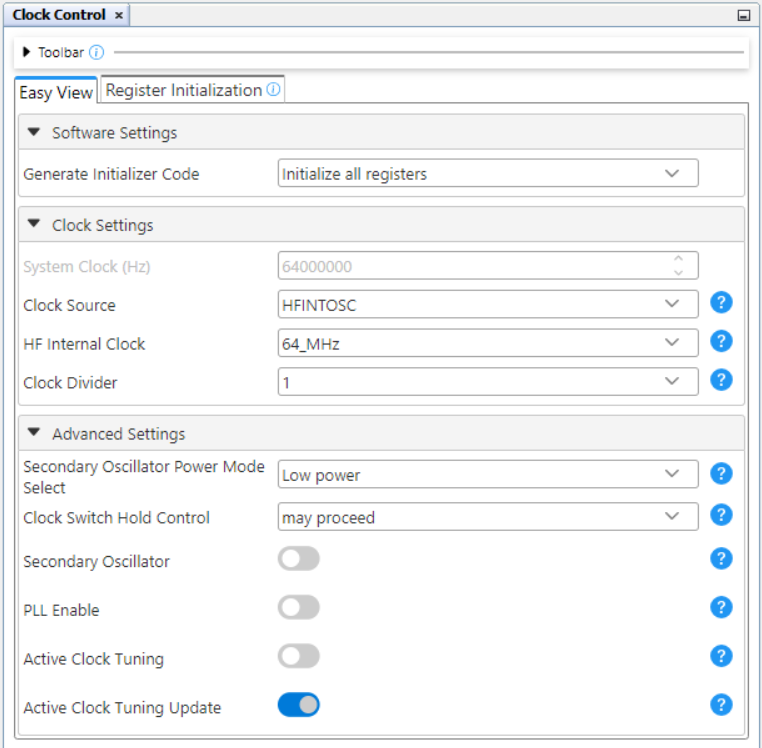
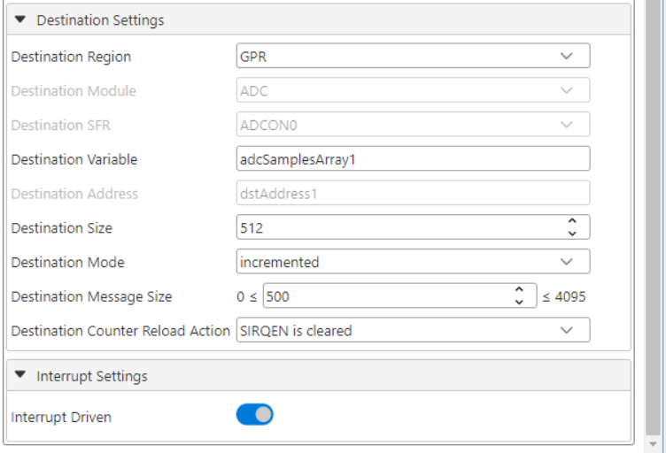
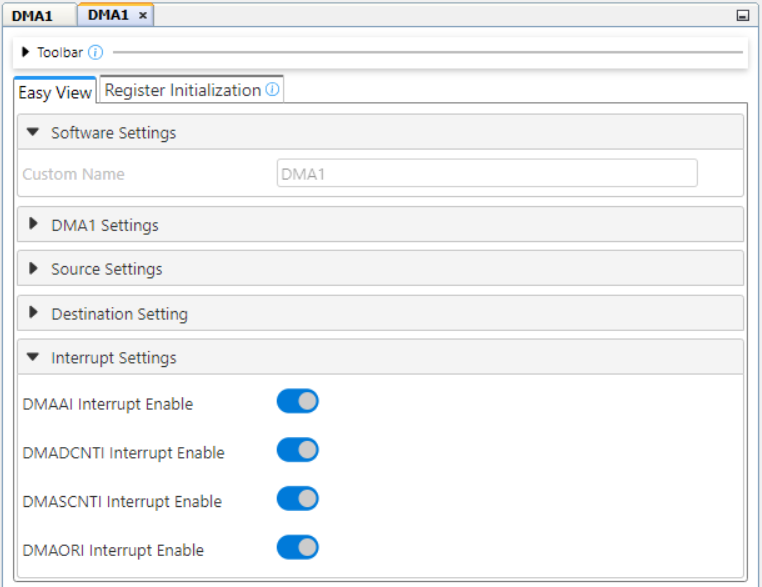
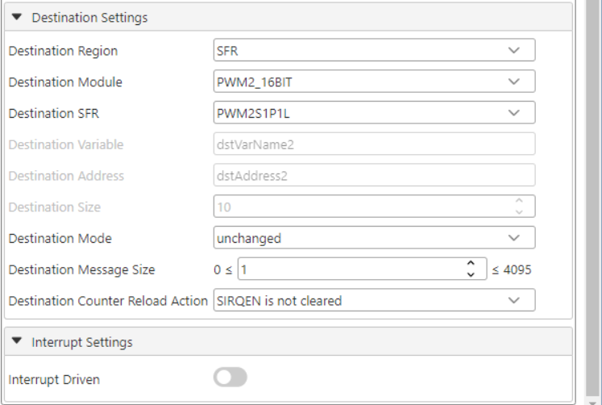
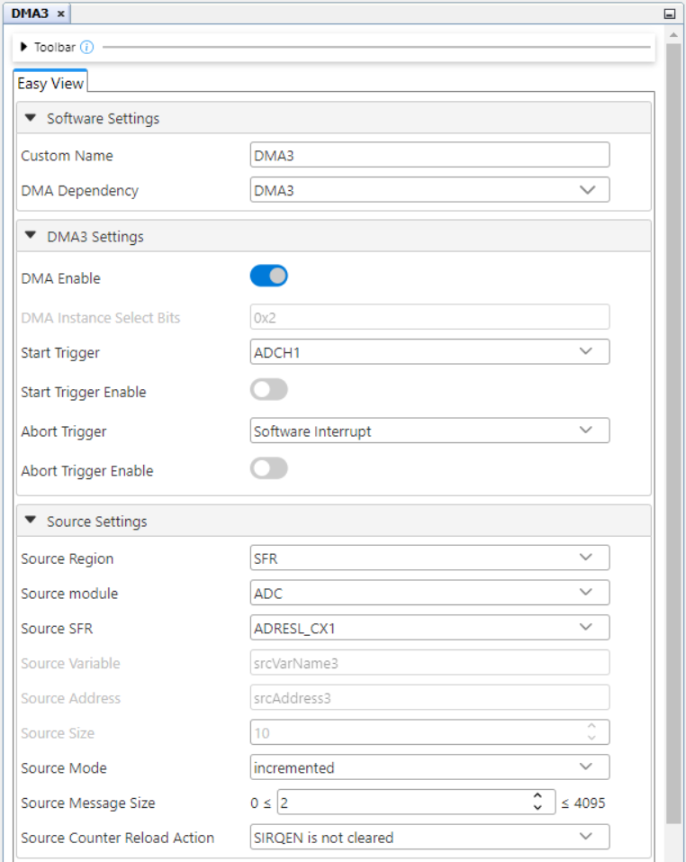
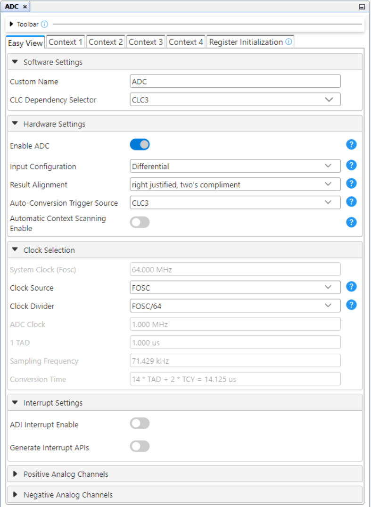
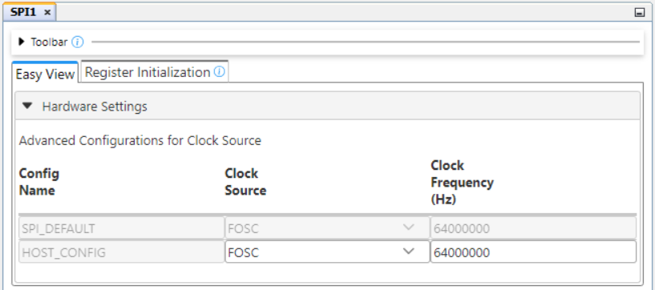
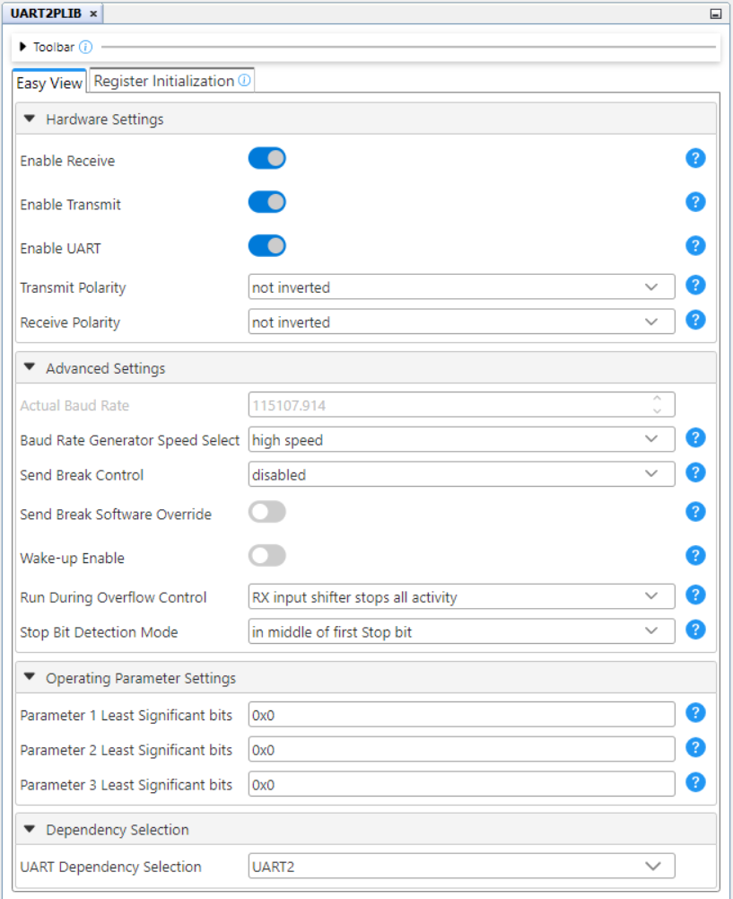

<!-- Please do not change this html logo with link -->

# RLC Meter Using the PIC18F56Q71 Microcontroller with MCC Melody

This repository contains a MPLAB® X project, a LCR meter implementation using the internal resources of PIC18F56Q71 microcontroller.  
In this code example, the PIC18F56Q71 microcontroller will be used to implement a RLC meter using the Operational Amplifier (OPAMP), Analog-to-Digital Converter with Computation and Context (ADCCC), Direct Memory Access (DMA), Timers (TMR0, TMR4) and CLC peripherals. The sinusoidal waveform is generated using the 10-bit Digital-to-Analog Converter (DAC) and other peripherals on the device (DMA, timers). The measurement will be displayed using serial protocols.

Note: This project is not an measurement instrument, it was developed only for educational purpose.

## Related Documentation
- [PIC18F56Q71 Product Page](https://www.microchip.com/en-us/product/PIC18F56Q71?utm_source=GitHub&utm_medium=TextLink&utm_campaign=MCU8_PIC18-Q71&utm_content=pic18f56q71-rlc-meter-mplab-mcc-github&utm_bu=MCU08)
- [PIC18F56Q71 Code Examples on Discover](https://mplab-discover.microchip.com/v2?dsl=PIC18F56Q71)
- [PIC18F56Q71 Code Examples on GitHub](https://github.com/microchip-pic-avr-examples/?q=PIC18F56Q71)

## Software Used

- [MPLAB X IDE v6.20 or newer](https://www.microchip.com/en-us/tools-resources/develop/mplab-x-ide?utm_source=GitHub&utm_medium=TextLink&utm_campaign=MCU8_PIC18-Q71&utm_content=pic18f56q71-rlc-meter-mplab-mcc-github&utm_bu=MCU08)
- [MPLAB® XC8 v2.46 or newer](https://www.microchip.com/en-us/tools-resources/develop/mplab-xc-compilers?utm_source=GitHub&utm_medium=TextLink&utm_campaign=MCU8_PIC18-Q71&utm_content=pic18f56q71-rlc-meter-mplab-mcc-github&utm_bu=MCU08)
- [PIC18F-Q_DFP 1.25.433](https://packs.download.microchip.com/)

## Hardware Used

- The [PIC18F56Q71 Curiosity Nano Development board](https://www.microchip.com/en-us/development-tool/EV01G21A?utm_source=GitHub&utm_medium=TextLink&utm_campaign=MCU8_PIC18-Q71&utm_content=pic18f56q71-rlc-meter-mplab-mcc-github&utm_bu=MCU08) is used as a test platform:
     

- [Curiosity Nano Adaptor](https://www.microchip.com/en-us/development-tool/ac164162)
     

- [MCP6022 OPAMP](https://www.microchip.com/en-us/product/mcp6022)
     

- 1.69 Inch IPS LCD Display
     
## Operation

To program the Curiosity Nano board with this MPLAB X project, follow the steps provided in the [How to Program the Curiosity Nano Board](#how-to-program-the-curiosity-nano-board) chapter.

## Concept

LCR meters are measuring instruments that measure a physical property known as impedance. Impedance, which is expressed using the quantifier Z, indicates resistance to the flow of an AC current. It can be calculated from the current I flowing to the measurement target and the voltage V across the target’s terminals. Since impedance is expressed as a vector on a complex plane, LCR meters measure not only the ratio of current and voltage RMS values, but also the phase difference between current and voltage waveforms. The result of the measurement is displayed using a LCD display or an USB-to-TTL converter connected to UART2 peripheral.

### Measurement principle

There are different methods used to measure the impedance, each of them with advantages and disadvantages:
- Automatic balanced bridge
- Resonant Method
- I-V Method

For this demo, the automatic balanced bridge is used, a circuit that is used in many LCR meters as the measurement circuit. The circuit has four terminals, all of which are connected to the measurement target. 

In the following picture is represented the concept used for this application. The OPAMPs used in this case are external. The second OPAMP is used to implement the automatic balanced bridge that was mentioned above. The principle behind this method is to determine the impedance by measuring the current and voltage.

-  

There is a MCU internal multiplexor that is used to select between the current and voltage aquisition. For an impedence measurement, the two of those aquisitions are performed starting with the voltage one. For both of them, the samples are saved in different buffers using DMA1/DMA3 peripherals. After that, the data is processed by multiplying with cosinus, respectively sinus values in order to calculate the real and imaginary parts for voltage and current.

-  

The two internal OPAMPs are used in configuration of instrumental amplifier with programmable gain. An autogain algorithm is used when a new component is inserted in order to independently determine the right gain for voltage and current measurements. The principle is to adjust the gain in order to obtain the maximum amplification that not saturates the output. The maximum value for voltage is determine when the device under test (DUT) is not connected and for the current by measuring in short. The minimum values are calculated as 20% of maximum. All results are previously determined and stored in defines.

### Sinusoidal waveform generation

The sinusoidal waveform is generated using on-chip Digital-to-Analog Converter (DAC1). The coresponding waveform values are stored into the Flash Program memory (const uint16_t wave_ROM_250[250]). To ensure precise timing for each sample, a DMA channel (DMA2) triggered by a periodic timer (TMR0) is used to transfer data from sine table to DAC1. The generated signal frequency can easily be modified by changing the TMR0 period as below:

$F = TMR0\_Frequency\ /\ SinTable\_steps$

The sine wave frequency can be modified using the *FREQ* define. The possible values are between 50 Hz and 1 KHz. For better results, it is recommended to use lower frequency (e.g. 100 Hz) for capacitance measurement and higher frequency for inductance.

### Synchronisation between generated signal and data aquired

To allow accurate values for computed impedance, the aquisition of the samples for current and voltage must be synchronized with input signal (generated waveform). The synchronisation between generated waveform and aquired samples is done using on-chip peripherals (CLCs, PWMs and timers):

-  
 
## Setup 

The following peripheral and clock configurations are set up using the MPLAB Code Configurator (MCC) Melody for the PIC18F56Q71:

1. Clock Control:
    - Clock Source: HFINTOSC
    - HF Internal Clock: 64_MHz
    - Clock Divider: 1
     

2. OPA1:
    - Enable OpAmp: Enabled
    - Op Amp Configuration: Non-Inverting Programmable Gain Amplifier
    - Positive Channel: OPA1IN+
    - Positive Source Selection: OPA1IN1+
    - Negative Channel: GSEL
    - Negative Source Selection: OPA1IN2-
     

3. OPA2:
    - Enable OpAmp: Enabled
    - Op Amp Configuration: Non-Inverting Programmable Gain Amplifier
    - Positive Channel: OPA2IN+
    - Positive Source Selection: OPA2IN2+
    - Negative Channel: GSEL
    - Negative Source Selection: OPA2IN0-
     

4. DMA1:
    - DMA Enable: Enabled
    - Start Trigger: ADCH1
    - Source Region: SFR
    - Source module: ADC
    - Source SFR: ADRESL_CX1
    - Source Mode: incremented
    - Source Message Size: 2
    - Source Counter Reload Action: SIRQEN is not cleared
    - Destination Region: GPR
    - Destination Variable: adcSamplesArray
    - Destination Size: 512
    - Destination Mode: incremented
    - Destination Message Size: 500
    - Destination Counter Reload Action: SIRQEN is cleared
    - Interrupt Driven: Enabled
     
     
     

5. DMA2:
    - DMA Enable: Enabled
    - Start Trigger: CLC1
    - Start Trigger Enable: Enabled
    - Source Region: Program Flash
    - Source Address: 0x0011F3
    - Source Mode: decremented
    - Source Message Size: 500
    - Source Counter Reload Action: SIRQEN is not cleared
    - Destination Region: SFR
    - Destination Module: DAC1
    - Destination SFR: DAC1DATH
    - Destination Mode: decremented
    - Destination Message Size: 2
    - Destination Counter Reload Action: SIRQEN is cleared
     
     

6. DMA3:
    - DMA Enable: Enabled
    - Start Trigger: ADCH1
    - Source Region: SFR
    - Source module: ADC
    - Source SFR: ADRESL_CX1
    - Source Mode: incremented
    - Source Message Size: 2
    - Source Counter Reload Action: SIRQEN is not cleared
    - Destination Region: GPR
    - Destination Variable: adcSamplesArray3
    - Destination Size: 512
    - Destination Mode: incremented
    - Destination Message Size: 500
    - Destination Counter Reload Action: SIRQEN is cleared
    - Interrupt Driven: Enabled
     
     
     

7. FVR:
    - Enable FVR: Enabled
    - FVR buffer gain to ADC: 1x
    - FVR buffer gain to other peripherals: 2x
     

8. DAC1:
    - VDD: 3.3
    - Required ref: 1.024
    - DAC Enable: Enabled
    - DAC Positive reference selection: VDD
    - DAC Negative reference selection: VSS
    - DAC Output Enable Selection: DACOUT1 Enabled and DACOUT2 Disabled
     

9. DAC3:
    - VDD: 2.048
    - Required ref: 1.016
    - DAC Enable: Enabled
    - DAC Positive reference selection: FVR
    - DAC Negative reference selection: VSS
    - DAC Output Enable Selection: DACOUT1 and DACOUT2 are Disabled
     

10. ADC:
    - ADC: Enabled
    - Input Configuration: differential mode
    - Auto-conversion Trigger Source: CLC3
    - Result Format: right justified, two's compliment
    - VDD (V): 3.3
    - External Positive Reference Voltage (V): 3.3
    - External Negative Reference Voltage (V): 0
    - Clock Selection: FOSC
    - Clock Divider: FOSC/64
     

11. ADC Context 1
    - Positive Channel Selection: ANB1
    - Positive Voltage Reference: VDD
    - Negative Channel Selection: ANA1
    - Negative Voltage Reference: VSS
    - Operating Mode Selection: Basic_mode
    - Threshold interrupt Mode: enabled
    - Upper Threshold (V): 1
    - Lower Threshold (V): 0
    - Threshold Setpoint (V): 0
    - Precharge Count: 6
    - Acquisition Count: 1
    - Previous Sample Input: FLTR
     
     

12. TMR0
    - Enable Timer: Enabled
    - Timer mode: 8-bit
    - Clock Prescaler: 1:8
    - Postscaler: 1:1
    - Clock Source: HFINTOSC
    - Requested Period (s): 0.000001
     

13. TMR4
    - Enable Timer: Enabled
    - Control mode: Roll over pulse
    - External Reset Source: CLC6_out
    - Start/Reset Option: Resets at TMR4_ers=0
    - Clock Source: CLC8_OUT
    - Clock Frequency (Hz): 1000
    - Prescaler: 1:1
    - Postscaler: 1:1
    - Time Period (s): 0.025
     

14. PWM1_16BIT
    - Enable PWM: Enabled
    - Clock Source: CLC8_OUT
    - Clock Frequency(KHz): 250
    - Mode: Left aligned mode
    - Requested Frequency(KHz): 1
    - Output1 Duty Cycle(%): 50
    - Output2 Duty Cycle(%): 51
     

15. CLC1
    - Enable CLC: Enabled
    - Logic Cell Mode bits: AND-OR
     

16. CLC3
    - Enable CLC: Enabled
    - Logic Cell Mode bits: AND-OR
     

17. CLC6
    - Enable CLC: Enabled
    - Logic Cell Mode bits: 1-input D flip-flop with S and R
     

18. CLC7
    - Enable CLC: Enabled
    - Logic Cell Mode bits: 1-input D flip-flop with S and R
     

19. CLC8
    - Enable CLC: Enabled
    - Logic Cell Mode bits: 1-input D flip-flop with S and R
     

20. SPI1
    - Clock Source: FOSC
    - Clock Frequency (Hz): 64000000
     

21. SPI1_Host
    - Config Name: HOST_CONFIG
    - Requested Speed (KHz): 6400
    - Mode: Mode 0
    - Data Input Sample At: Middle
     

22. UART2
    - Requested Baudrate: 115200
    - Parity: None
    - Data Size: 8
    - Stop Bits: 1
    - Redirect Printf to UART: Enabled
     

23. UART2 PLIB
    - Enable Receive: Enabled
    - Enable Transmit: Enabled
    - Enable UART: Enabled
     

In the next table there are presented the LCD connections:

|     **Pin**      |  **Connection**   |  **Custom Name**  | 
| :-------:        | :-------:         | :-------:         | 
|   GND            | GND               |     -             | 
|   VCC            | 3.3V              |     -             | 
|   SCL            |     RC6           |     -             |   
|   SDA            |     RC2           |     -             |   
|   RES            |     RF7           |     LCD_RST       | 
|   DC             |     RF6           |     LCD_DC        | 
|   CS             |     RF3           |     LCD_CS        |  
|   BLK            |     RF2           |     LCD_BL        | 

## Demo

In order to demonstrate the capabilities of this application, a 3.3uF capacitor measurement was performed. The result can be seen in the following picture.

 

## Summary

This project showcases the PIC18F56Q71 peripherals's capabilities in a measurement application. For this case, the majority of peripherals are used for creating a complex use case.

##  How to Program the Curiosity Nano Board 

This chapter demonstrates how to use the MPLAB X IDE to program a PIC® device with an Example_Project.X. This is applicable to other projects.

1.  Connect the board to the PC.

2.  Open the Example_Project.X project in MPLAB X IDE.

3.  Set the Example_Project.X project as main project.
     Right click the project in the **Projects** tab and click **Set as Main Project**.
     

4.  Clean and build the Example_Project.X project.
     Right click the **Example_Project.X** project and select **Clean and Build**.
     

5.  Select **PICxxxxx Curiosity Nano** in the Connected Hardware Tool section of the project settings:
     Right click the project and click **Properties**.
     Click the arrow under the Connected Hardware Tool.
     Select **PICxxxxx Curiosity Nano** (click the **SN**), click **Apply** and then click **OK**:
     

6.  Program the project to the board.
     Right click the project and click **Make and Program Device**.
     

 

- - - 
## Menu
- [Back to Top](#rlc-meter-using-the-pic18f56q71-microcontroller-with-mcc-melody)
- [Back to Related Documentation](#related-documentation)
- [Back to Software Used](#software-used)
- [Back to Hardware Used](#hardware-used)
- [Back to Operation](#operation)
- [Back to Concept](#concept)
- [Back to Setup](#setup)
- [Back to Demo](#demo)
- [Back to Summary](#summary)
- [Back to How to Program the Curiosity Nano Board](#how-to-program-the-curiosity-nano-board)