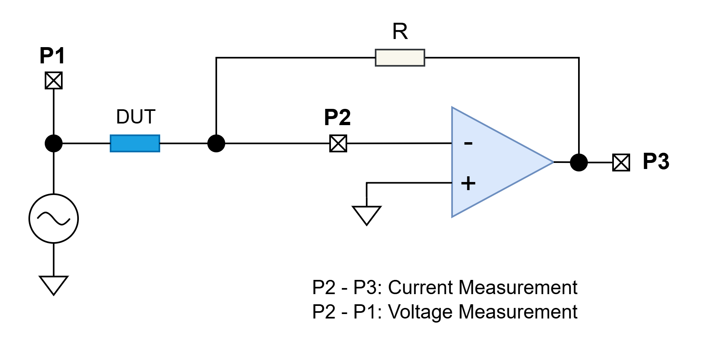
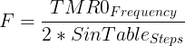
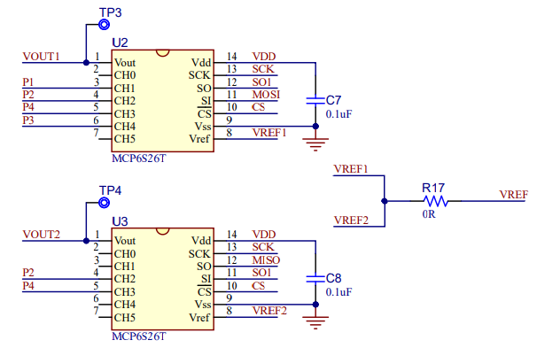
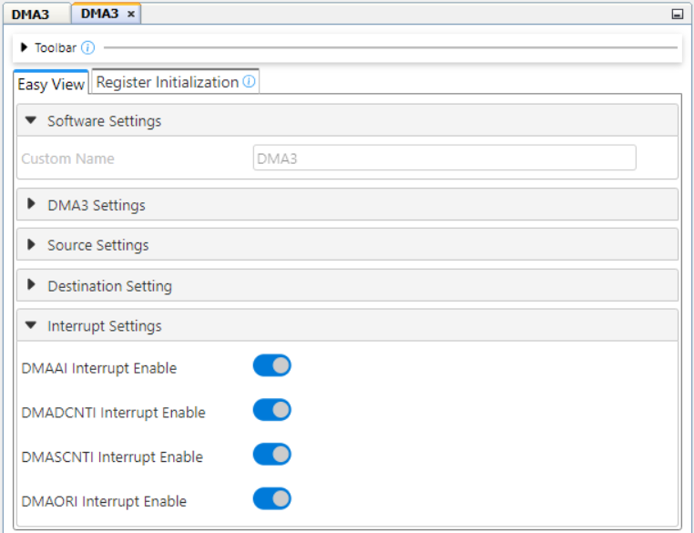
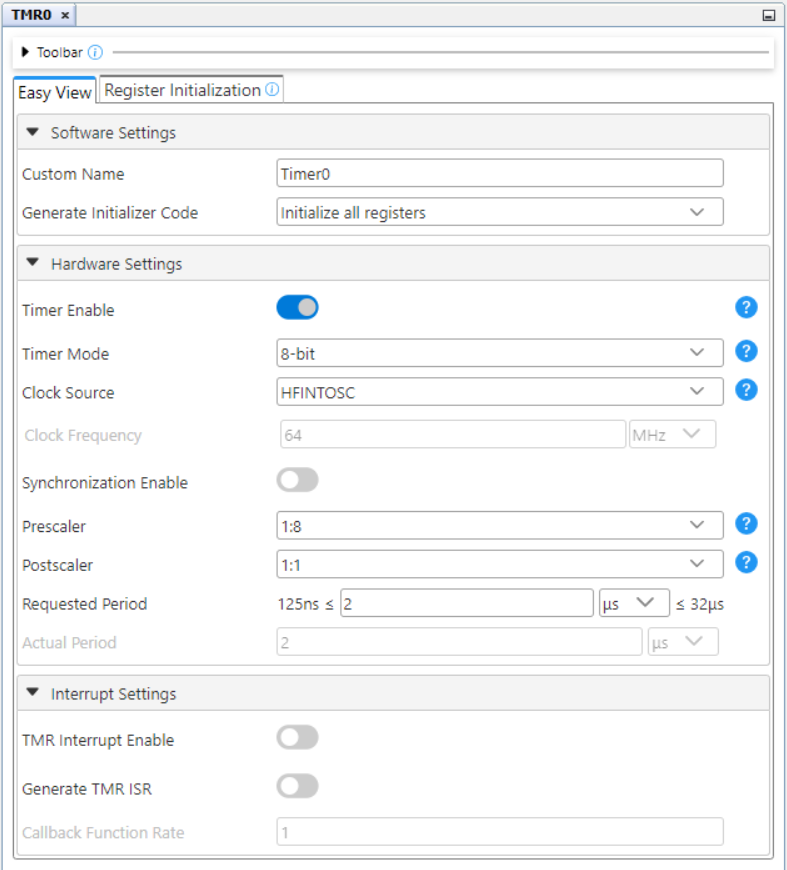
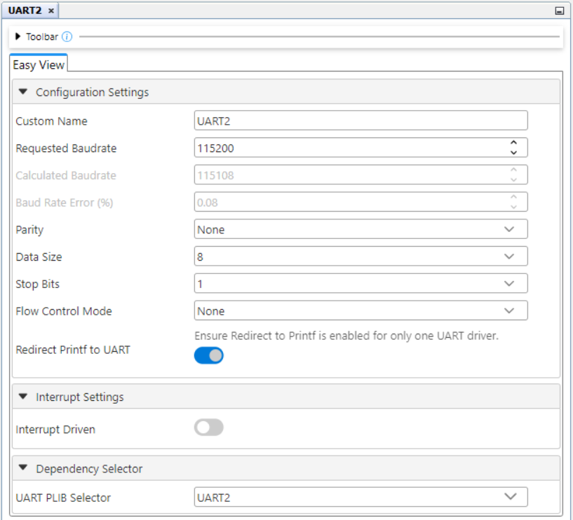

<!-- Please do not change this html logo with link -->

# RLC Meter Using the PIC18F56Q71 Microcontroller with MCC Melody

This repository contains an MPLAB® X project, a Resistance, Inductance, Capacitance (RLC) meter implementation using the internal resources of PIC18F56Q71 microcontroller.  
In this code example, the PIC18F56Q71 microcontroller will be used to implement a RLC meter using the Analog-to-Digital Converter (ADC) with Computation and Context, Direct Memory Access (DMA), Timers (TMR0, TMR2, TMR4) and Configurable Logic Cell (CLC) peripherals. The sinusoidal waveform is generated using the Pulse-Width Modulator with Compare (PWM) and other peripherals on the device (DMA, timers). The measurement will be displayed using serial protocols.

**Note**: This project is not an measurement instrument, it was developed only for educational purpose.

## Related Documentation
- [PIC18F56Q71 Product Page](https://www.microchip.com/en-us/product/PIC18F56Q71?utm_source=GitHub&utm_medium=TextLink&utm_campaign=MCU8_PIC18-Q71&utm_content=pic18f56q71-rlc-meter-mplab-mcc-github&utm_bu=MCU08)
- [PIC18F56Q71 Code Examples on Discover](https://mplab-discover.microchip.com/v2?dsl=PIC18F56Q71)
- [PIC18F56Q71 Code Examples on GitHub](https://github.com/microchip-pic-avr-examples/?q=PIC18F56Q71)

## Software Used

- [MPLAB X IDE v6.20 or newer](https://www.microchip.com/en-us/tools-resources/develop/mplab-x-ide?utm_source=GitHub&utm_medium=TextLink&utm_campaign=MCU8_PIC18-Q71&utm_content=pic18f56q71-rlc-meter-mplab-mcc-github&utm_bu=MCU08)
- [MPLAB® XC8 v2.50 or newer](https://www.microchip.com/en-us/tools-resources/develop/mplab-xc-compilers?utm_source=GitHub&utm_medium=TextLink&utm_campaign=MCU8_PIC18-Q71&utm_content=pic18f56q71-rlc-meter-mplab-mcc-github&utm_bu=MCU08)
- [PIC18F-Q_DFP 1.25.433](https://packs.download.microchip.com/)

## Hardware Used

- The [PIC18F56Q71 Curiosity Nano Development board](https://www.microchip.com/en-us/development-tool/EV01G21A?utm_source=GitHub&utm_medium=TextLink&utm_campaign=MCU8_PIC18-Q71&utm_content=pic18f56q71-rlc-meter-mplab-mcc-github&utm_bu=MCU08) is used as a test platform:
     

- [Curiosity Nano Adaptor](https://www.microchip.com/en-us/development-tool/AC164162?utm_source=GitHub&utm_medium=TextLink&utm_campaign=MCU8_PIC18-Q71&utm_content=pic18f56q71-rlc-meter-mplab-mcc-github&utm_bu=MCU08)
     

- [OLED C CLICK Board](https://www.mikroe.com/oled-c-click#/263-clickid-yes) (mikroBUS socket 3)
     

- RLC Meter Click Board (mikroBUS socket 1)
     

## Operation

To program the Curiosity Nano board with this MPLAB X project, follow the steps provided in the [How to Program the Curiosity Nano Board](#how-to-program-the-curiosity-nano-board) section.

## Concept

RLC meters are measuring instruments that measure a physical property known as impedance. Impedance, which is expressed using the quantifier Z, indicates resistance to the flow of an alternating current (AC). It can be calculated from the current (I) flowing to the measurement target and the voltage (V) across the target’s terminals. Since impedance is expressed as a vector on a complex plane, RLC meters measure not only the ratio of current and voltage RMS values, but also the phase difference between current and voltage waveforms. The result of the measurement is displayed using an OLED display or the UART2 peripheral.

### Measurement Principle

There are different methods used to measure the impedance, each of them with advantages and disadvantages:
- Auto-Balancing Bridge Method
- Resonant Method
- I-V Method

This demo uses an auto-balancing bridge which is the measurement circuit in many RLC meters. The circuit has four terminals, all of which are connected to the measurement target. The following image shows the concept used for this method. The OPAMP implements the automatic balanced bridge that was mentioned above. The principle behind this method is to determine the impedance by measuring the current and voltage.
 

### Sinusoidal Waveform Generation

The sinusoidal waveform is generated using the PWM2 peripheral. The PWM duty-cycle is updated using a sine Look-Up Table (LUT) that is stored into the Flash Program memory (const uint8_t waveROM250[250]). The resulted waveform is then filtered using an external low-pass filter to obtain the sinusoidal signal. To ensure precise timing for each sample, a DMA channel (DMA2) triggered by CLC1 is used to transfer data from the sine table to PWM2. The PWM2 frequency is set to 1 MHz, meaning that for the maximum frequency of the resulted sine wave of 1 KHz, the PWM duty-cycle is updated in 250 steps at every four PWM periods, ensuring a stable output. The generated sinusoidal signal frequency can easily be modified by changing the number of PWM periods after the duty-cycle is updated. This is done by changing the TMR0 period with the formula below. The multiplication with the `2` factor is done because the TMR0 output is used in a Divide-by-Two circuit implemented with the CLC8 peripheral.

 

 

The sine wave frequency can be modified in the program using the `FREQ` macro. The possible values are between 100 Hz and 1 KHz. For better results, it is recommended to use lower frequency (e.g. 100 Hz) for capacitance measurement and higher frequency for inductance.

### Measurement board

The measurement circuit is realised on a board that can be used on a mikroBUS™ socket. The entire schematic and Gerber files of the board can be found in the `Board Documents` folder.

The following image shows the schematic of the low-pass filter and auto-balancing bridge. A [MCP6022](https://www.microchip.com/en-us/product/mcp6022?utm_source=GitHub&utm_medium=TextLink&utm_campaign=MCU8_PIC18-Q71&utm_content=pic18f56q71-rlc-meter-mplab-mcc-github&utm_bu=MCU08) is used for the two OPAMPs. The first one is used for the filter that generates the sine wave from the PWM signal. The second one implements the automatic balanced bridge that was mentioned above. The device under test (DUT) is connected in the circuit using the J1 connector.
 
 **Note:** The R18 resistor is not connected on the board.

The selection between the current and voltage acquisition is done using two [MCP6S26](https://www.microchip.com/en-us/product/mcp6s26?utm_source=GitHub&utm_medium=TextLink&utm_campaign=MCU8_PIC18-Q71&utm_content=pic18f56q71-rlc-meter-mplab-mcc-github&utm_bu=MCU08) PGAs that have an internal multiplexer used to select between the six possible inputs. The PGAs multiplexers for input and gain selection can be programmed using the Serial Peripheral Interface (SPI) and they are connected in a daisy-chain configuration. The two PGAs have multiple inputs connected for different configurations of the circuit. The following configuration is used for this application:

|**Measurement**|**PGA1 (U2) Channel**|**PGA2 (U3) Channel**| 
| :-------:     | :-----------------: | :-----------------: |
|    Current    |         CH3         |         CH2         | 
|    Voltage    |         CH1         |         CH2         |  

 
 **Note:** The R17 resistor offers the possibility to connect the VREF of the two PGAs together (R17 not connected) or to the board VREF (R17 connected). In this case, the R17 resistor is connected.

A second [MCP6022](https://www.microchip.com/en-us/product/mcp6022?utm_source=GitHub&utm_medium=TextLink&utm_campaign=MCU8_PIC18-Q71&utm_content=pic18f56q71-rlc-meter-mplab-mcc-github&utm_bu=MCU08) is used for the VREF signal and to obtain the output signal. The VREF is set to VDD/2, meaning 1.65 V. The second OPAMP is used in differential to single-ended configuration to obtain a single output from the two PGAs that is used for the ADC input.
 

The board is used at 3.3 V. The power source can be selected using the R20 and R21 resistors. By connecting the R20 resistor, the board is powered from the 3V3 pin on the mikroBus socket. By connecting the R21 resistor, the board is powered from an external LDO (such as [MCP1700](https://www.microchip.com/en-us/product/mcp1700?utm_source=GitHub&utm_medium=TextLink&utm_campaign=MCU8_PIC18-Q71&utm_content=pic18f56q71-rlc-meter-mplab-mcc-github&utm_bu=MCU08)) that is connected to the 5V pin on the mikroBus socket and offers 3V3 output.
 
 **Note:** Just one resistor (R20 or R21) must be connected on the board. R20 resistor is connected on the presented one.

### Synchronization Between the Generated Signal and the Data Acquired

To allow accurate values for computed impedance, the acquisition of the samples for current and voltage must be synchronized with input signal (generated waveform). The synchronization between generated waveform and acquired samples is done using on-chip peripherals like CLCs, Pulse-Width Modulation (PWM) and timers:
 

The TMR4 peripheral is used for oversampling to increase the acquiring rate of the waveform. The sampling rate can be configured using the `TIMESAMPLING_RATE` macro.

### Waveform Acquisition

The MCP6S26 input multiplexer is used to select between the current and voltage acquisition. For an impedance measurement, two of those acquisitions are performed starting with the voltage one. For both of them, the samples are saved in different buffers using alternatively DMA1/DMA3 peripherals. To calculate the real and imaginary parts for voltage and current, the processed data is multiplied by cosinus wave and sinus wave, respectively. The results are then scaled using the gain values. The DAC1 peripheral is used to eliminate the DC component of the signal.

The usage of oversampling means that more periods of the sinusoidal signal are used for the acquisition (the number is equal to the time sampling rate) and the samples are not acquired in order for a reconstruction of a single sine wave. To calculate the real and imaginary parts described above, the acquired samples are read in the order of acquisition and the corresponding cosinus/sinus value for each sample is determined based on the chosen sampling rate. 
 

### Calibration and Auto Gain

The MCP6S26 gain selection multiplexer is used to implement an auto gain algorithm when a new component is inserted to independently determine the right gain for voltage and current measurements. The principle is to adjust the gain to obtain the maximum amplification that does not saturate the output. The maximum value for voltage is determined when the DUT is not connected and for the current by measuring in short circuit. The measured values are then increased with 40%. The values used for comparisons in the algorithm are the raw read data, that are not scaled using the gain factor.

The maximum values are automaticaly determined using a calibration process and the determined values are then stored into the on-board EEPROM by using the Nonvolatile Memory Module (NVM) peripheral. This way, when the application is started, it verifies if there are calibration data stored in EEPROM by reading and verifying a byte that is stored at a known address. If the calibration data are available, they are read, stored in variables and used in the auto gain algorithm described above. If they are not available, the user can start the calibration for voltage and current by short pressing the on-board button and following the displayed instructions. The user can also begin the calibration process when the application is already running with a long press of the button. TMR2 peripheral is used for detection of the short and long press of the button.
 
## Setup

The following peripheral and clock configurations are set up using the MPLAB Code Configurator (MCC) Melody for the PIC18F56Q71:

1. Clock Control:
    - Clock Source: HFINTOSC
    - HF Internal Clock: 64_MHz
    - Clock Divider: 1
     

2. DMA1:
    - DMA Enable: Enabled
    - Start Trigger: ADCH1
    - Source Region: SFR
    - Source module: ADC
    - Source SFR: ADRESL_CX1
    - Source Mode: incremented
    - Source Message Size: 2
    - Source Counter Reload Action: SIRQEN is not cleared
    - Destination Region: GPR
    - Destination Variable: adcSamplesArray1
    - Destination Size: 512
    - Destination Mode: incremented
    - Destination Message Size: 500
    - Destination Counter Reload Action: SIRQEN is cleared
    - Interrupt Driven: Enabled
     
     
     

3. DMA2:
    - DMA Enable: Enabled
    - Start Trigger: CLC1
    - Start Trigger Enable: Enabled
    - Source Region: Program Flash
    - Source Address: 0x001000
    - Source Mode: incremented
    - Source Message Size: 250
    - Source Counter Reload Action: SIRQEN is not cleared
    - Destination Region: SFR
    - Destination Module: PWM2_16BIT
    - Destination SFR: PWM2S1P1L
    - Destination Mode: unchanged
    - Destination Message Size: 1
    - Destination Counter Reload Action: SIRQEN is not cleared
     
     

4. DMA3:
    - DMA Enable: Enabled
    - Start Trigger: ADCH1
    - Source Region: SFR
    - Source module: ADC
    - Source SFR: ADRESL_CX1
    - Source Mode: incremented
    - Source Message Size: 2
    - Source Counter Reload Action: SIRQEN is not cleared
    - Destination Region: GPR
    - Destination Variable: adcSamplesArray3
    - Destination Size: 512
    - Destination Mode: incremented
    - Destination Message Size: 500
    - Destination Counter Reload Action: SIRQEN is cleared
    - Interrupt Driven: Enabled
     
     
     

5. DAC1:
    - Vdd: 3.3
    - Required Voltage Ref: 1.65
    - DAC Enable: Enabled
    - DAC Positive reference selection: VDD
    - DAC Negative reference selection: VSS
    - DAC Output Enable Selection: DACOUT1 and DACOUT2 are Disabled
     

6. ADC:
    - ADC: Enabled
    - Input Configuration: Differential
    - Result Format: right justified, two's compliment
    - Auto-conversion Trigger Source: CLC3
    - Clock Selection: FOSC
    - Clock Divider: FOSC/64
     

7. ADC Context 1
    - Positive Channel Selection: ANA1
    - Positive Voltage Reference: VDD
    - Negative Channel Selection: DAC1
    - Negative Voltage Reference: VSS
    - Computation mode: Basic_mode
    - Threshold Interrupt Mode: Enabled
    - Upper Threshold: 1
     

8. TMR0
    - Enable Timer: Enabled
    - Timer Mode: 8-bit
    - Clock Source: HFINTOSC
    - Clock Prescaler: 1:8
    - Postscaler: 1:1
    - Requested Period: 2 μs
     

9. TMR2
    - Enable Timer: Disabled
    - Control Mode: Roll over pulse
    - Clock Source: LFINTOSC
    - Prescaler: 1:32
    - Postscaler: 1:4
    - Requested Period: 1 s
    - TMR Interrupt Enable: Enabled
     

10. TMR4
    - Enable Timer: Enabled
    - Control mode: Roll over pulse
    - External Reset Source: CLC6_out
    - Start/Reset Option: Resets at TMR4_ers=0
    - Clock Source: CLC8_OUT
    - Clock Frequency: 250 kHz
    - Prescaler: 1:1
    - Postscaler: 1:1
    - Requested Period: 44 μs
     

11. PWM1_16BIT
    - Enable PWM: Enabled
    - Clock Source: CLC8_OUT
    - Clock Frequency(KHz): 250
    - Mode: Left aligned mode
    - Requested Frequency(KHz): 1
    - Output1 Duty Cycle(%): 50
     

12. PWM2_16BIT
    - Enable PWM: Enabled
    - Clock Source: FOSC
    - Mode: Left aligned mode
    - Requested Frequency(KHz): 1000
     

13. CLC1
    - Enable CLC: Enabled
    - Logic Cell Mode bits: AND-OR
    - Enable Rising Interrupt: Enabled
     

14. CLC3
    - Enable CLC: Enabled
    - Logic Cell Mode bits: AND-OR
    - Enable Rising Interrupt: Enabled
     

15. CLC6
    - Enable CLC: Enabled
    - Logic Cell Mode bits: 1-input D flip-flop with S and R
     

16. CLC7
    - Enable CLC: Enabled
    - Logic Cell Mode bits: 1-input D flip-flop with S and R
     

17. CLC8
    - Enable CLC: Enabled
    - Logic Cell Mode bits: 1-input D flip-flop with S and R
    - Enable Rising Interrupt: Enabled
     

18. SPI1
    - Clock Source: FOSC
    - Clock Frequency (Hz): 64000000
     

19. SPI1_Host
    - Config Name: HOST_CONFIG
    - Requested Speed (KHz): 1000
    - Mode: Mode 0
    - Data Input Sample At: Middle
     

20. UART2
    - Requested Baudrate: 115200
    - Parity: None
    - Data Size: 8
    - Stop Bits: 1
    - Redirect Printf to UART: Enabled
     

21. UART2PLIB
    - Enable Receive: Enabled
    - Enable Transmit: Enabled
    - Enable UART: Enabled
     

22. NVM
    - Generate EEPROM APIs: Enabled
     

23. CPU
    - DMA1 Priority Register: priority level 4
    - DMA2 Priority Register: priority level 3
    - Interrupt Service Routine Priority Register: priority level 6
     
     DMA2 is used to generate the sine wave and need to have the highest priority.

24. Interrupt Manager
     

25. Pins
     

| Pin | Configuration  |          Description         | Custom name |
| :-: | :------------: | :--------------------------: |:-----------:|
| RD6 |  Analog output |        CLC3 output           |      -      |
| RC6 | Digital output |          SPI1 SCK            |      -      |
| RC5 | Digital input  |          SPI1 SDI            |      -      |
| RC2 | Digital output |          SPI1 SDO            |      -      |
| RB0 | Analog output  |          PWM2OUT1            |      -      |
| RF2 | Analog output  |          PWM1OUT1            |      -      |
| RB5 | Digital input  |          UART2 RX            |      -      |
| RB4 | Digital output |          UART2 TX            |      -      |
| RA1 |  Analog input  |  ADC positive input channel  |      -      |
| RA0 | Digital input  |      Button input pin        |   BUTTON    |
| RA4 | Digital output |      OLED board RW pin       |  oledC_RW   |
| RA5 | Digital output |    RLC Meter board CS pin    |   RLC_CS    |
| RA6 | Digital output |          Debug pin           |  DEBUG_PIN  |
| RB2 | Digital output |      OLED board DC pin       |  oledC_DC   |
| RC7 | Digital output |        On-board LED          |  DEBUG_LED  |
| RF4 | Digital output |      OLED board EN pin       |  oledC_EN   | 
| RF5 | Digital output |      OLED board RST pin      |  oledC_RST  | 
| RF7 | Digital output |      OLED board CS pin       |  oledC_nCS  | 
| RW0 | Digital input  |      CLC8IN0 / CLC3IN0       |      -      |
| RW1 | Digital input  |           CLC6IN1            |      -      |
| RW2 | Digital input  |           CLC7IN2            |      -      | 

## Demo

In order to demonstrate the capabilities of this application, a 1 μF capacitor measurement was performed. The result can be seen in the following picture.

 

The result can also be visualised in [MPLAB Data Visualizer](https://www.microchip.com/en-us/tools-resources/debug/mplab-data-visualizer?utm_source=GitHub&utm_medium=TextLink&utm_campaign=MCU8_PIC18-Q71&utm_content=pic18f56q71-rlc-meter-mplab-mcc-github&utm_bu=MCU08).
 

## Summary

This project showcases the PIC18F56Q71 peripherals' capabilities in a measurement application. For this case, the majority of peripherals are used to create a complex use case.

##  How to Program the Curiosity Nano Board 

This chapter demonstrates how to use the MPLAB X IDE to program a PIC® device with an Example_Project.X. This is applicable to other projects.

1.  Connect the board to the PC.

2.  Open the Example_Project.X project in MPLAB X IDE.

3.  Set the Example_Project.X project as main project.
     Right click the project in the **Projects** tab and click **Set as Main Project**.
     

4.  Clean and build the Example_Project.X project.
     Right click the **Example_Project.X** project and select **Clean and Build**.
     

5.  Select **PICxxxxx Curiosity Nano** in the Connected Hardware Tool section of the project settings:
     Right click the project and click **Properties**.
     Click the arrow under the Connected Hardware Tool.
     Select **PICxxxxx Curiosity Nano** (click the **SN**), click **Apply** and then click **OK**:
     

6.  Program the project to the board.
     Right click the project and click **Make and Program Device**.
     

 

- - - 
## Menu
- [Back to Top](#rlc-meter-using-the-pic18f56q71-microcontroller-with-mcc-melody)
- [Back to Related Documentation](#related-documentation)
- [Back to Software Used](#software-used)
- [Back to Hardware Used](#hardware-used)
- [Back to Operation](#operation)
- [Back to Concept](#concept)
- [Back to Setup](#setup)
- [Back to Demo](#demo)
- [Back to Summary](#summary)
- [Back to How to Program the Curiosity Nano Board](#how-to-program-the-curiosity-nano-board)